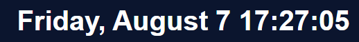
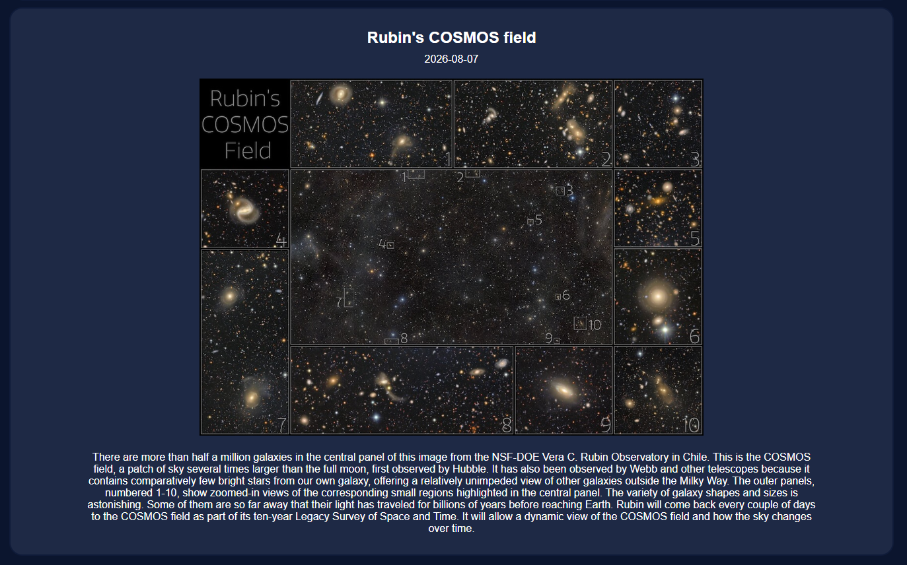
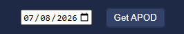

# Holo Tab

Holo tab is a simple new tab project made for Stardance's "Give your website a pulse" mission. It is connected to NASA's free API to display the Astronomy Picture of the Day directly on your new tab page. 

[Website](https://rasmusstenlund.github.io/holo-tab/) | [NASA API](https://api.nasa.gov/)

## What does it feature?
Holo Tab features:
- A clock of the local date and time.

- NASA's APOD (Astronomic Picture of the Day) alongside its title, date and explanation by fetching from their API. 

- A date input feature where you can view previous APODs

